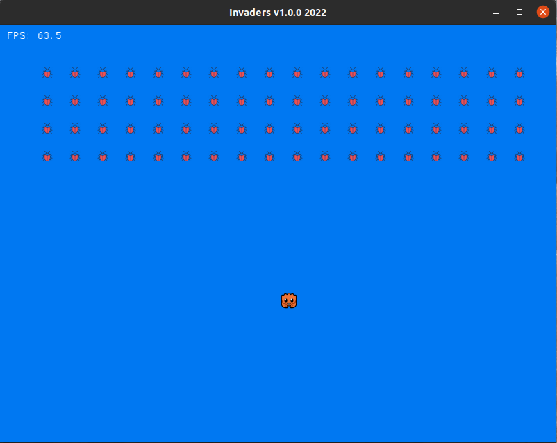

# Invaders v1

## Description

Another invaders clone.

Based on Nathan Stocks code:

https://github.com/CleanCut/invaders/

And some ideas from Jeremy Chone code:

https://github.com/jeremychone-channel/rust-invaders



## Dependencies

* [macroquad](https://github.com/not-fl3/macroquad)


## Build and run

```
cargo build --release

cargo run --release

cargo build --target wasm32-unknown-unknown --release

cp ../target/wasm32-unknown-unknown/release/invaders.wasm wasm/

cd wasm

python3 -m http.server
```

## Author

* [Antonio Soares](https://github.com/ccie18473)

## License

This project is licensed under the [MIT] License - see the LICENSE.md file for details

